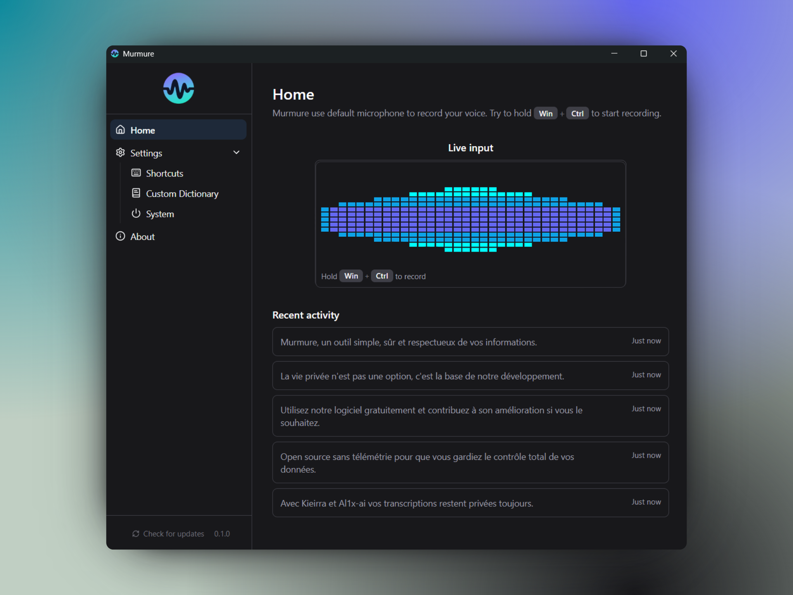

# Murmure

A privacy-first, open-source speech-to-text application that runs entirely on your machine, powered by a neural network via NVIDIA’s Parakeet model for fast, local transcription. Murmure turns your voice into text with no internet connection and zero data collection, and supports 25 European languages.

## Features

- **Privacy First**: All processing happens locally on your device. No data ever leaves your computer.
- **No Telemetry**: Zero tracking, zero analytics. Your data stays yours, always.
- **Open Source**: Free and open source software. Inspect, modify, and contribute.
- **Powered by Parakeet**: NVIDIA’s state-of-the-art speech recognition model runs entirely on-device for fast, low-latency transcription.

## Supported Languages:

Bulgarian (bg), Croatian (hr), Czech (cs), Danish (da), Dutch (nl), English (en), Estonian (et), Finnish (fi), French (fr), German (de), Greek (el), Hungarian (hu), Italian (it), Latvian (lv), Lithuanian (lt), Maltese (mt), Polish (pl), Portuguese (pt), Romanian (ro), Slovak (sk), Slovenian (sl), Spanish (es), Swedish (sv), Russian (ru), Ukrainian (uk)

## Installation

### Windows

The Windows build is self-signed, as I'm not paying certification authorities just to remove the SmartScreen warning. Because of that, Windows may show a security message when you install it. The installer is safe, it will simply build its reputation over time as more users run it, and the warning will gradually disappear.

1. Download murmure_{version}_x64_en-US.msi from the [release](https://github.com/Kieirra/murmure/releases) page
2. Run the installer and follow the setup wizard.

### Linux

1. Download murmure_{version}_amd64.AppImage from [release](https://github.com/Kieirra/murmure/releases) page
2. Make it executable: `chmod +x murmure-x86_64.AppImage`
3. Run the AppImage.

## Usage

Murmure provides a clean and focused speech-to-text experience.
Once launched, simply start recording your voice. The text appears instantly, processed directly on your computer.

Typical use cases include:

- Dictating to any AI prompt (Cursor, ChatGPT, Mistral, etc.)
- Writing notes hands-free
- Capturing creative ideas or dictation

Because all computation is local, no network connection is required.

## Technology

Murmure uses NVIDIA’s Parakeet TDT, a highly optimized, experimental transformer-based speech recognition model designed for low-latency, on-device inference. It combines fast transcription with strong accuracy across multiple languages, running efficiently on consumer GPUs or CPUs.

## Changelog

| Version       | Date       | Notes                                                                                                                                                                                                                                                                    |
| ------------- | ---------- | ------------------------------------------------------------------------------------------------------------------------------------------------------------------------------------------------------------------------------------------------------------------------ |
| `1.3.0`       | 2025-10-25 | **🐛 Bug Fixes** - Fixed small memory leak - Fixed the unwanted \"v\" key activation when assigning shortcuts - Corrected the GitHub link  **✨ New Features** - Added an experimental API allowing Murmure to connect with external software _(can be enabled in Settings → System)_ - Improved shortcut UI for better usability - Removed the experimental tag for the Linux AppImage. It now works identically to the Windows version (users who had the experimental version need to reinstall it to benefit from the "check for updates" feature) |
| `1.2.1`       | 2025-10-17 | Fix overlay position + check for updates button + signed msi + Linux experimental AppImage                                                                                                                                                                               |
| `1.2.0-alpha` | 2025-10-14 | Add Overlay                                                                                                                                                                                                                                                              |
| `1.1.0-alpha` | 2025-10-13 | Add 'Past last transcript' shortcut                                                                                                                                                                                                                                      |
| `1.0.0-alpha` | 2025-10-13 | Initial version                                                                                                                                                                                                                                                          |
## 🗺️ Roadmap 

- [ ] Create an onboarding website for non technical user (in progress)  
- [ ] Fix bug: the visualizer does not always reset at the end of a transcription  
- [ ] Add a button to clear transcription history  
- [ ] Display the overlay on the active screen  
- [ ] Scale overlay based on screen DPI or add a zoom option  
- [ ] Allow selecting the input microphone 
- [ ] Add keyboard shortcuts to start and stop recording (outside push-to-talk mode)  
- [ ] Improve the custom dictionary algorithm  
- [ ] API: Create an API to fetch the latest transcription  
- [ ] API(Webhook): Send an HTTP request after `CTRL + SPACE`, opens up many interesting possibilities  
- [ ] Allow uploading an audio file and outputting a `.txt` transcript  
- [ ] Support MP3 files in addition to WAV (since some recorders use MP3)  
- [ ] Add benchmarking vs Whisper and Plaud: identify where the model performs best (microphone speech, conference, meeting) and test potential optimizations  
- [ ] **Major:** Add real-time streaming  
- [ ] **Major:** Integrate an LLM to enhance or modify transcriptions  
- [ ] **Major:** Implement a plugin system  

## Acknowledgments

- Thanks to NVIDIA for the Parakeet TDT model, Tauri for being an amazing tool, and to the open‑source community for their tools and libraries.

## License

Murmure is free and open source, released under the GNU GPL v3 License.
You can inspect, modify, and redistribute it freely as long as derivative works remain open source.

## Contributing

Contributions are welcome!
If you’d like to improve Murmure or report an issue:

Pre-requisite :

- (windows) Install Visual Studio Build Tools 2022 (Desktop C++ workload)
- (linux) Install Vulkan
- Install git lfs

1. Fork the repository
2. Create a feature branch (git checkout -b feature/new-feature)
3. Commit your changes (git commit -m "Add new feature")
4. Push and open a pull request

## Support Development

If you like Murmure and want to support its development: [Support on Tipeee](https://fr.tipeee.com/murmure-al1x-ai/)
